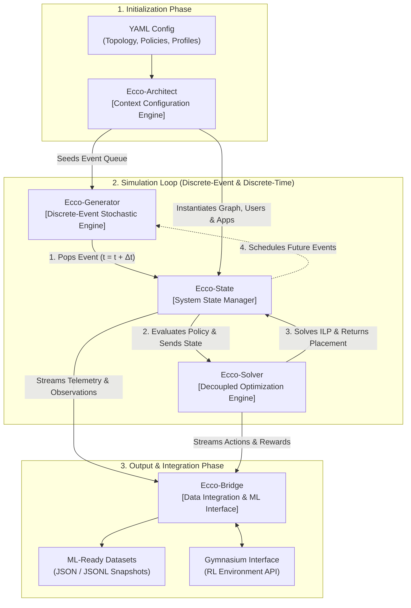

# ECCOS: Event-Driven Computing Continuum Orchestration Solver

[](https://www.python.org/)
[](LICENSE)
[](https://doi.org/10.5281/zenodo.22947855)
[](#architecture-and-modular-design)
[](#reproducing-the-paper-experiments)
[](#how-to-cite)

**ECCOS** (*Event-Driven Computing Continuum Orchestration Solver*) is a discrete-event simulation framework designed for modeling dynamic service placement, network entropy, and optimization in Computing Continuum (Cloud-Fog-Edge) environments. 

Developed as an open-source research platform, ECCOS bridges the gap between low-level packet simulators and macroscopic analytical models. It natively couples declarative scenario definition with mathematically grounded optimization engines (ILP and heuristics), outputting high-dimensional, telemetry-rich traces explicitly structured for training Supervised and Reinforcement Learning (RL) models.

---

## Table of Contents

- [Key Contributions](#key-contributions)
- [Architecture and Modular Design](#architecture-and-modular-design)
- [Prerequisites and Installation](#prerequisites-and-installation)
- [Running Simulations (General Usage)](#running-simulations-general-usage)
- [Reproducing the Paper Experiments](#reproducing-the-paper-experiments)
- [Precomputed Traces & Zenodo Open Dataset](#precomputed-traces--zenodo-open-dataset)
- [Generating Publication Plots](#generating-publication-plots)
- [Regenerating Architectural & UML Diagrams](#regenerating-architectural--uml-diagrams)
- [Project Directory Structure](#project-directory-structure)
- [Research Methodology: Spec-Driven Development](#research-methodology-spec-driven-development)
- [How to Cite](#how-to-cite)
- [Funding & Acknowledgments](#funding--acknowledgments)
- [License](#license)

---

## Key Contributions

1. **Scalable Dataset Generation for Machine Learning:** Natively produces structured output traces rich in state variables, topological states, and reward metrics for continuous ML/RL training.
2. **Modular Architecture & Decoupled Solvers:** Logical decoupling between scenario generation, stochastic event queues, system state accounting, and placement solvers (Single/Multi-Objective ILP, Greedy, heuristics).
3. **Fine-grained Declarative Configuration (YAML):** Fully declarative scenario definition (topologies, statistical distributions, event frequencies, and impacts) ensuring strict cross-platform reproducibility.
4. **Rigorous Stochastic Modeling & Event Composition:** Extensive catalog of native base events (node degradation, link congestion, user disconnection, mobility drifts) with a composite event engine to simulate realistic phenomena (brownouts, flash crowds, electric storms).
5. **Dynamic "Day 2" Lifecycle & SFC/DAGs:** Supports runtime elasticity, resource footprint variations, and multi-service workflows represented as Service Function Chains (SFC) or Directed Acyclic Graphs (DAG).

---

## Architecture and Modular Design

ECCOS employs a modular, decoupled design structured around five foundational components:



- **`Ecco-Architect`:** Parses the YAML configuration, validates schemas, and builds the synthetic multi-tier network graph, services, and user population.
- **`Ecco-Generator`:** Manages the global discrete-event priority queue, scheduling base and composite actions according to domain-specific statistical distributions.
- **`Ecco-State`:** Maintains the transactional state of the infrastructure (available capacities, degraded links), active applications (SFC chains, requirements), and connected users.
- **`Ecco-Solver`:** Decoupled optimization backend. Formulates and solves placement as an Integer Linear Program (using PuLP/CBC) or heuristic algorithm under latency, migration, and resource constraints.
- **`Ecco-Bridge`:** Telemetry and ingestion engine that transforms state transitions into high-dimensional, ML-ready datasets (JSON/CSV) and Gymnasium-compatible RL environments.

---

## Prerequisites and Installation

### System Requirements
- **Python:** 3.11 or later
- **Graphviz System Binary:** (Required for rendering vector architecture figures)
  - **macOS:** `brew install graphviz`
  - **Ubuntu/Debian:** `sudo apt install graphviz`
  - **Fedora/RHEL:** `sudo dnf install graphviz`

### Setup Environment

```bash
# 1. Clone the repository
git clone https://github.com/carlosguerrero/ECCOS.git
cd ECCOS

# 2. Create and activate a Python virtual environment
python3 -m venv .venv
source .venv/bin/activate       # On Windows: .venv\Scripts\activate

# 3. Install dependencies
pip install -r requirements.txt

# 4. (Optional) Install the package in editable mode
pip install -e .
```

---

## Running Simulations (General Usage)

The entry point `main.py` runs a standalone simulation using configurable scenario and solver YAML files:

```bash
# Run with default configuration (1000 iterations)
python main.py

# Run with custom parameters
python main.py --scenario scenario_config.yaml --solver solver_config.yaml --iterations 2000 --seed 42

# Validate configuration files against the schema without running
python main.py --validate scenario_config.yaml
# Or with the installed CLI:
eccos --validate experiments/configuration_files/*.yaml
```

### Command-Line Arguments for `main.py`

| Argument | Short | Default | Description |
| :--- | :--- | :--- | :--- |
| `--scenario` | `-s` | `scenario_config.yaml` | Path to the scenario configuration YAML file. |
| `--solver` | `-c` | `solver_config.yaml` | Path to the solver & optimization objective configuration YAML. |
| `--iterations` | `-i` | `1000` | Total number of discrete simulation steps. |
| `--seed` | | `42` | Master random seed (guarantees bit-identical reproducibility). |
| `--validate` | | *None* | Validates one or more YAML files against `config_schema.json` and exits. |


### Output Data
Each execution generates a timestamped directory under `Simulations_raw/<scenario>_<solver>_<timestamp>/` containing:
- `Simulation{i}.json`: Full snapshot before and after each event, including placement mapping, node capacity allocations, network delays, and triggered actions.
- `execution.log`: Comprehensive execution trace with timing and solver metrics.

---

## Reproducing the Paper Experiments

The repository includes the exact YAML configurations used in the research paper. The batch runner `run_experiments.py` orchestrates these experiments under identical random seeds and parameters.

### Available Benchmark Scenarios

| ID | Experiment Scenario | Configuration File | Simulated Phenomena |
| :-: | :--- | :--- | :--- |
| **1** | **Electric Storm** | `experiments/configuration_files/scenario_1_electric_storm.yaml` | Severe weather event triggering correlated node dropouts and edge failures across physical zones, testing failover and recovery. |
| **2** | **Crowd Event** | `experiments/configuration_files/scenario_2_crowd_event.yaml` | Concentrated user influx (stadium/protest) creating an ultra-dense hotspot, fast user arrivals, and heavy localized service demand. |
| **3** | **Demand Surge** | `experiments/configuration_files/scenario_3_demand_surge.yaml` | Sudden viral surge in service popularity combined with localized node/edge degradations (brownouts). |
| **4** | **Normal Conditions** | `experiments/configuration_files/scenario_4_normal_conditions.yaml` | Steady-state baseline with standard Poisson/exponential arrivals, uniform mobility, and degree-correlated resource distribution. |

### Running the Experiments

```bash
# List all available paper scenarios
python run_experiments.py --list

# Run all 4 paper experiments (default: 1000 iterations each)
python run_experiments.py

# Run all 4 experiments for 5000 iterations (paper production run)
python run_experiments.py --iterations 5000

# Run only specific scenarios (e.g., Scenario 1 and Scenario 2)
python run_experiments.py --experiments 1 2 --iterations 1000
```

---

## Precomputed Traces & Zenodo Open Dataset

Due to GitHub's repository size recommendations, the precomputed 5,000-step raw telemetry traces (~3.1 GB uncompressed across all 4 benchmark scenarios) are permanently archived on **Zenodo**:

- **Zenodo DOI:** [10.5281/zenodo.22947855](https://doi.org/10.5281/zenodo.22947855)
- **Archive Contents:** Per-step Markov Decision Process (MDP) state transitions $(s_t, a_t, r_t, s_{t+1})$, topology states, placement decisions, and objective metrics.
- **License:** Creative Commons Attribution 4.0 International (CC-BY 4.0)

### Quick Download & Setup:
```bash
# 1. Download the archive from Zenodo
curl -L -o eccos_simulation_traces.tar.gz https://zenodo.org/records/22947855/files/eccos_simulation_traces.tar.gz?download=1

# 2. Extract into the expected experiments results directory
tar -xzf eccos_simulation_traces.tar.gz -C experiments/simulation_json_outputs_results/

# 3. Directly generate publication figures from the downloaded traces
python experiments/run_all_plots.py --skip-geo
```

> **Note:** Downloading the Zenodo dataset is optional. Researchers can reproduce the exact raw telemetry locally by executing `python run_experiments.py --iterations 5000` with the deterministic master seed (`42`).

---

## Generating Publication Plots

The orchestrator `experiments/run_all_plots.py` processes simulation output datasets and generates publication-quality vector figures (PDF) matching the paper's results.

```bash
# Generate all plots for all 4 experiments (skipping per-step geo maps for faster run)
python experiments/run_all_plots.py --skip-geo

# Run only specific plot families (e.g., Plot 16: Heatmap, Plot 17: User Tracks)
python experiments/run_all_plots.py --only 16 17

# Run plots for a specific experiment (e.g., Experiment 2: Crowd Event)
python experiments/run_all_plots.py --experiments 2 --skip-geo

# Point to a custom simulation data directory
python experiments/run_all_plots.py --data-dir experiments/simulation_json_outputs_results
```

### Catalog of Generated Plots

| Plot ID | Metric / Visualization | Output File Prefix |
| :-: | :--- | :--- |
| **Plot 1** | System Overview (Active users, apps, nodes, edges) | `plot1_system_overview_` |
| **Plot 2** | Step-by-Step Geolocation & Connectivity Maps | `plot2_geolocation_` |
| **Plot 3** | Application Popularity Distribution | `plot3_app_popularity_` |
| **Plot 4** | User Activity & State Transitions | `plot4_user_activity_` |
| **Plot 5** | Node Resource Availability & Saturation | `plot5_node_availability_` |
| **Plot 6** | Event Timeline (Discrete Steps) | `plot6_event_timeline_` |
| **Plot 7** | Optimization Metric Evolution | `plot7_optimization_` |
| **Plot 8** | Application Request Rate | `plot8_app_request_rate_` |
| **Plot 9** | Single-Objective Placement Latency | `plot9_single_objective_` |
| **Plot 10** | Event Timeline (Continuous Simulation Time) | `plot10_event_timeline_by_time_` |
| **Plot 11** | Optimization Metric (by Time) | `plot11_optimization_by_time_` |
| **Plot 12** | Single-Objective Latency (by Time) | `plot12_single_objective_by_time_` |
| **Plot 13** | Node Availability (by Time) | `plot13_node_availability_by_time_` |
| **Plot 14** | Application Migration Events | `plot14_app_migrations_` |
| **Plot 15** | Application Request Rate Lines | `plot15_app_request_rate_lines_` |
| **Plot 16** | User Mobility Heatmap (Intermediate & Final States) | `plot16_user_heatmap_` |
| **Plot 17** | User Trajectory Tracks (Spatial Density) | `plot17_user_tracks_` |

*All generated graphics are saved in `experiments/figures/` in vector PDF format.*

---

## Regenerating Architectural & UML Diagrams

The structural and UML diagrams presented in the paper can be regenerated from their declarative Graphviz source scripts:

```bash
# 1. Generate the main ECCOS Architecture diagram (Figure 1 in paper)
python paper_figures/src/ECCOSdiagramPlot.py

# 2. Generate the complete UML Ecosystem schema
python paper_figures/src/UMLDiagramPlot.py

# 3. Generate all modular UML subdiagrams (Infra, Users, Apps, Global)
python paper_figures/src/UMLSubdiagramsPlot.py
```

*Output PDFs are stored in [`paper_figures/figures/`](paper_figures/figures).*

---

## Project Directory Structure

```text
servicePlacementDataset/
├── .gitignore
├── pyproject.toml                     # Modern PEP 621 package metadata & dependencies
├── requirements.txt                   # Direct dependency specification
├── LICENSE                            # Open source MIT License
├── CITATION.cff                       # Citation metadata format
├── README.md                          # Comprehensive documentation
├── config_schema.json                 # JSON Schema validating scenario definitions
├── scenario_config.yaml               # Default base scenario configuration
├── solver_config.yaml                 # Default solver and objective weights
├── main.py                            # Standalone simulation CLI entrypoint
├── run_experiments.py                 # Automated batch experiment runner
├── src/                               # ECCOS Simulation Engine Core
│   ├── appSet.py                      # Application & microservice lifecycle logic
│   ├── infrastructure.py              # Graph generation, routing & tier mapping
│   ├── userSet.py                     # User population, mobility & request profiles
│   ├── eventSet.py                    # Stochastic event queue & composite triggers
│   ├── simulationSet.py               # Seeded random generators (per-domain RNG)
│   ├── simulation_runner.py           # Core discrete-event execution loop
│   ├── simulation.py                  # Snapshot serialization & telemetry logging
│   ├── types.py                       # Enumerations and dataclasses
│   ├── constants.py                   # Default thresholds and system constants
│   ├── factories/                     # Network topology & graph factories
│   └── solvers/                       # ILP & heuristic placement solvers
├── experiments/                       # Paper Experiments and Evaluation
│   ├── configuration_files/           # 4 Benchmark YAML scenario configurations
│   ├── simulation_json_outputs_results/ # Raw simulation data traces
│   ├── plotting_scripts/              # 17 specialized matplotlib plot modules
│   ├── figures/                       # Rendered evaluation figures (PDF/PNG)
│   └── run_all_plots.py               # Master plotting pipeline orchestrator
├── paper_figures/                     # Architectural Figures for the Paper
│   ├── src/                           # Standalone Graphviz generator scripts
│   └── figures/                       # Vector architectural PDFs (Figure 1, UMLs)
├── supporting_documents/              # Research Methodology and Technical Notes
│   ├── spec_driven_catalog/           # Formal Spec-Driven Development specifications
│   └── design_notes/                  # Mathematical models, SFC, and topology notes
└── latex/                             # Article LaTeX Source Files
    ├── main.tex                       # Manuscript source
    └── scenario_2_latex_section.tex   # Formal description of Scenario 2
```

---

## Research Methodology: Spec-Driven Development

ECCOS was engineered using a **Spec-Driven Development** methodology. Every stochastic event, composite macro-event, and resource allocation behavior was mathematically specified prior to implementation:

- Detailed event specifications are archived in [`supporting_documents/spec_driven_catalog/`](supporting_documents/spec_driven_catalog).
- Structural design notes on SFC DAG formulations, topology models, and solver constraints are archived in [`supporting_documents/design_notes/`](supporting_documents/design_notes).

---

## How to Cite

If you use **ECCOS** in your research, simulation studies, or baseline comparisons, please cite our paper:

```bibtex
@article{jaume2026eccos,
  title   = {{Event-Driven Computing Continuum Orchestration Solver (ECCOS): A Discrete-Event Simulation Framework for Optimal Service Placement and ML-Ready Trace Generation}},
  author  = {Jaume, Mireia and Lera, Isaac and Guerrero, Carlos},
  journal = {Submitted for evaluation},
  year    = {2026},
  note    = {Software available at: \url{https://github.com/carlosguerrero/ECCOS}}
}
```

*For software citation via GitHub or Zenodo, refer to [`CITATION.cff`](CITATION.cff).*

---

## Funding & Acknowledgments

This research is supported by **Grant PID2024-158637OB-I00**, funded by **MICIU / AEI / 10.13039/501100011033** and co-funded by the European Union through the **European Regional Development Fund (ERDF)** — *"A way of making Europe"*.

Developed by members of the **Computer Science Department** at the **University of the Balearic Islands (UIB)**, Palma, Spain.

---

## License

This project is licensed under the **MIT License** — see the [`LICENSE`](LICENSE) file for details.

